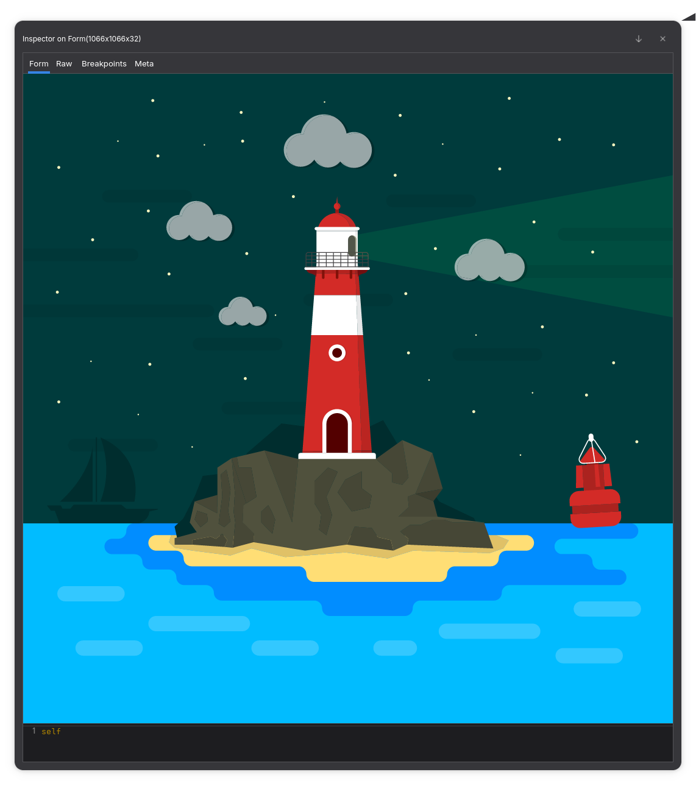

This are [Pharo](https://github.com/pharo-project/pharo) bindings for the [resvg](https://github.com/linebender/resvg) 
library, generated using [pharo-cig](https://github.com/estebanlm/pharo-cig).  

The generation recipe can be found at the class comment of [LibResvg class](https://github.com/estebanlm/pharo-resvg/blob/main/src/ReSVG/LibResvg.class.st).

## Screenshot

